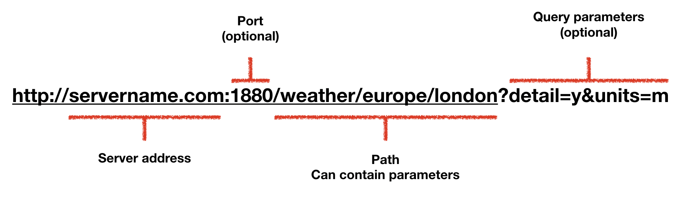
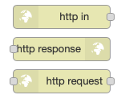

*Quick links :*
[Home](/README.md) - [Part 1](../part1/README.md) - [**Part 2**](../part2/README.md) - [Part 3](../part3/README.md) - [Part 4](../part4/README.md) - [Part 5](../part5/README.md)
***
**Part 2** - [Local Node-RED](NODERED.md) - [**Web and REST APIs**](API.md) - [Calling an API from Node-RED](CALLING_API.md) - [Implementing an API in Node-RED](CREATING_API.md) - [API Practical](API_PRACTICAL.md)
***

# Web APIs and REST APIs

Using HTTP based communication is a common way for applications and micro-services to communicate in cloud native applications.

The HTTP protocol is a client-server protocol, where the client makes a request to the server and the server responds.

Calling an API requires a few pieces of information:

- address of the server
- the http request method (GET, POST, PUT, DELETE, PATCH)
- optionally parameters/data to be passed to the server
- optionally headers, to pass additional information to the server

## HTTP request / response

When a client makes a request to a server it uses a URL to identify the server and specify what server resource the client wants.  The request sent to the server contains the HTTP method the request wants to access, a header section and a body section.

The server responds with a message containing a header section and a body section.

### URL

The URL (Uniform Resource Locator) contains a number of pieces of information to identify the server on the network and also identify the service or resource on the server the client wants to access.  The URL can also contain additional data to add additional detail to the request, which can be thought of as parameters to an API call:

### Request Method

The request method is used to specify what action the client wants perform on the server.  The following are the most commonly used methods for APIs:

- GET - Read or retrieve data.  Get should never add or change data
- POST - Create or send data
- PUT - Update or replace data
- PATCH - Partial update or modify data
- DELETE - Delete data

### Headers

Headers are key value pairs and specify additional details about the request or response.  Header keys, more commonly called Fields, are case sensitive.

Some common headers used are:

- Accept - Used to specify data format(s) the client wants to receive from the server  
  Accept: text/html
- Accept-Language - Used to specify the language(s) the client wants to receive from the server  
  Accept-Language: en-US
- Content-Type - Used to specify the data type contained in the body of a request of response  
  Content-Type: application/json

### Body

The body of an HTTP request or response is used to send data.  The format of the data should be specified in the Content-Type header.

## REST

REST stands for REpresentational State Transfer.  It is an architectural style not a protocol.  REST does not mandate the use of the HTTP protocol, but it is the most common protocol used for the client server exchange.

REST defines a set of constraints to define the ways the server can process and respond to client requests to gain desirable non-functional properties, such as performance, scalability, simplicity, reliability, etc. The architectural constraints are:

- Client-server architecture
- Statelessness
- Cacheability
- Layered system
- code on demand (optional)
- Uniform interface

If a system violates any of the required constraints then it cannot be considered RESTful.

REST does not define how the HTTP request methods are used in a RESTful API, but guidelines recommend following the usage defined above.

The important thing is that the use of the HTTP methods is uniform and consistent across the API.

## HTTP APIs in Node-RED

Node-RED has a standard set of nodes to make it really easy to call HTTP APIs and implement HTTP APIs in Node-RED.

***
**Part 2** - [Local Node-RED](NODERED.md) - [**Web and REST APIs**](API.md) - [Calling an API from Node-RED](CALLING_API.md) - [Implementing an API in Node-RED](CREATING_API.md) - [API Practical](API_PRACTICAL.md)
***
*Quick links :*
[Home](/README.md) - [Part 1](../part1/README.md) - [**Part 2**](../part2/README.md) - [Part 3](../part3/README.md) - [Part 4](../part4/README.md) - [Part 5](../part5/README.md)
