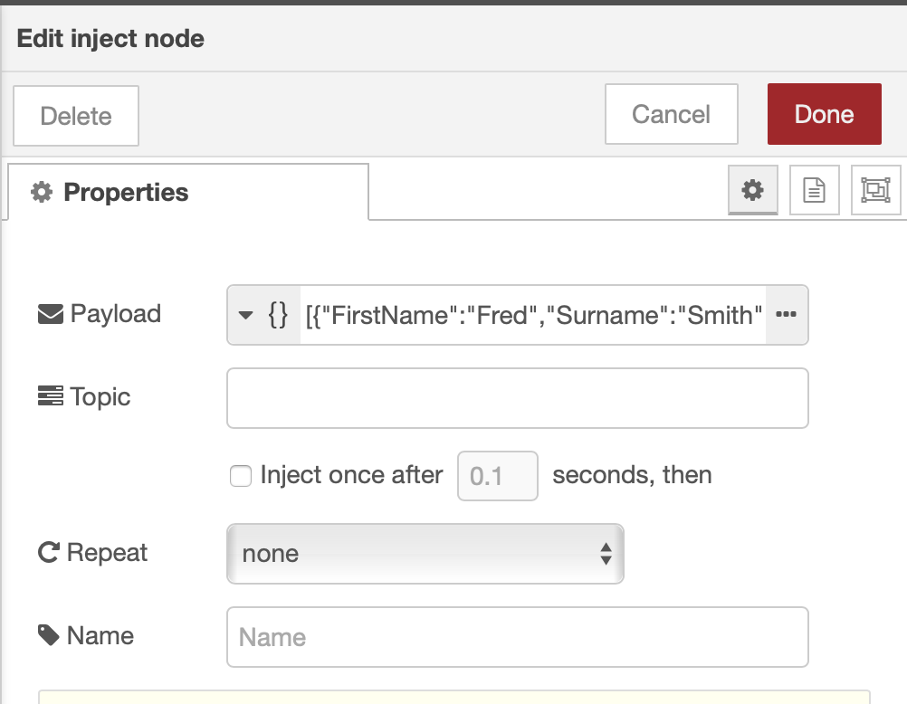
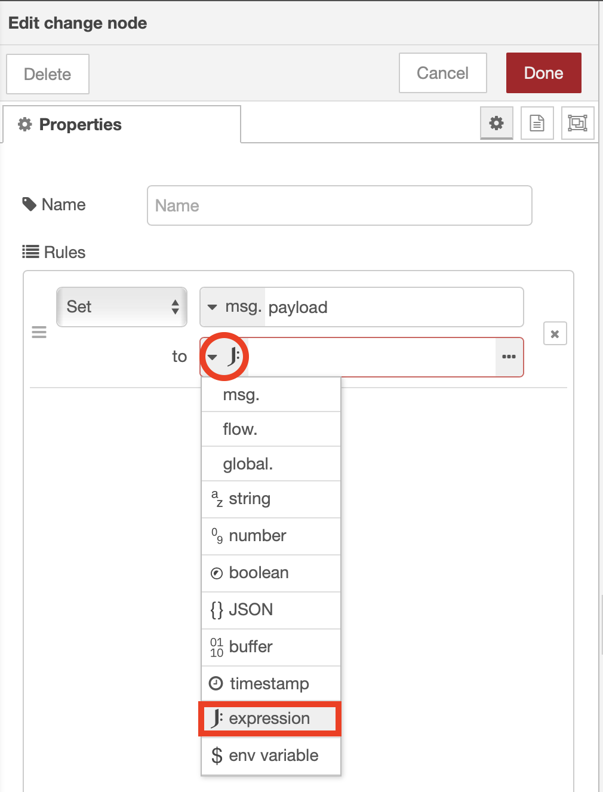
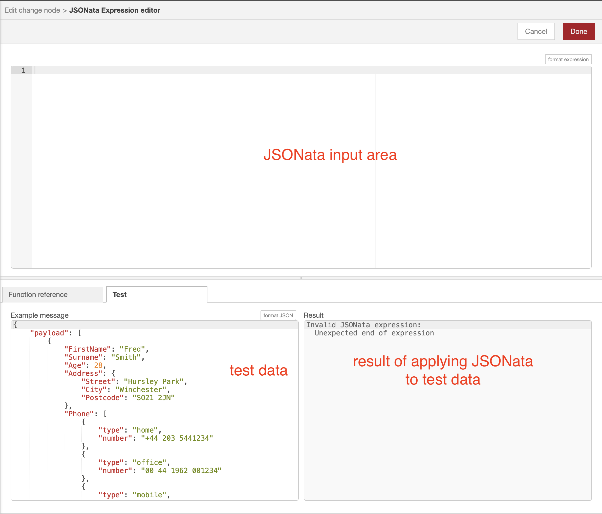
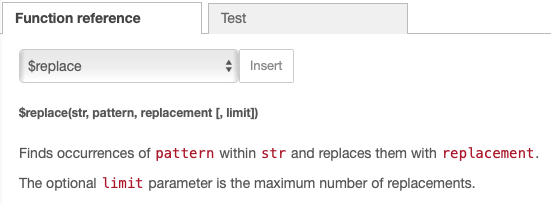
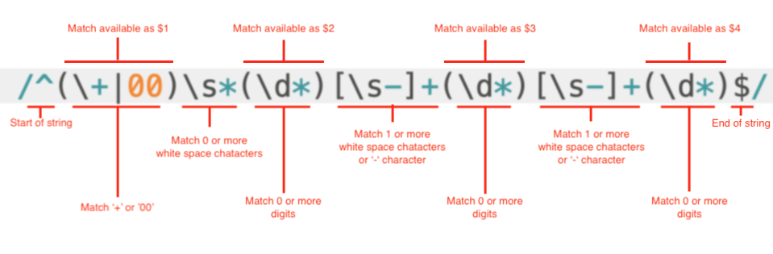

# Formatting JSON with JSONata

For this section we will use the following data:

```JSON
[
  {
    "FirstName": "Fred",
    "Surname": "Smith",
    "Age": 28,
    "Address": {
      "Street": "Hursley Park",
      "City": "Winchester",
      "Postcode": "SO21 2JN"
    },
    "Phone": [
      {
        "type": "home",
        "number": "+44 203 5441234"
      },
      {
        "type": "office",
        "number": "00 44 1962 001234"
      },
      {
        "type": "mobile",
        "number": "0044 7777-001234"
      }
    ]
  },
  {
    "FirstName": "Freda",
    "Surname": "Smith",
    "Age": 25,
    "Address": {
      "Street": "Hursley Park",
      "City": "Winchester",
      "Postcode": "SO21 2JN"
    },
    "Phone": [
      {
        "type": "home",
        "number": "+44 203 9871234"
      },
      {
        "type": "office",
        "number": "00 44 1962 998765"
      },
      {
        "type": "mobile",
        "number": "0044 7777-098765"
      }
    ]
  }
]
```

We want to transform the input JSON above (say it came from a REST API call) to a different format.  For this example we want to:

- combine the FirstName and Surname fields into a single name E.g. "Fred Smith"
- create a set of phone properties, with the number type (home, office, mobile) as the key and the phone number as the value E.g.```{"home":"+44 203 5441234", "office":"00 44 1962 001234", "mobile":"0044 7777-001234"}```
- unify the format used in phone numbers to a standard format E.g. "+44 203-5441234", "+44 1962-001234", "+44 7777-001234"

We could use a function node to do this, but JSONata is a more efficient way to achieve this and is a powerful transformation engine available within change and switch nodes.

## Combine name fields

1. In Node-RED create and inject node, change node and debug node and connect the 3 nodes together
2. Open the input node properties and set the Payload field to JSON then copy the JSON above into the field.
  
3. Open the change node properties and set it to output the results of a JSONata expression
  
4. Open the JSONata editor 
5. Switch to the Test tab and paste the sample JSON as the payload.  You need to have the test data within a "payload" property for the JSONata to work within the change node.  Using the JSONata editor will allow you to see the results of the JSONata live as you type it in
  
6. Enter the JSONata expression ```{ "Name" : payload.FirstName & ' ' & payload.Surname }```.  Observer the result.  This is not quite what we want.  It is taking all first names and create an array of first names then takes all surnames and create an array of them.  We will fix this in the next step.
    - **&** is the string concatenation operator in JSONata
7. The output we want is to create a JSON object for each JSON object in the test data.  To do this we move the payload to the start of the expression then use the dot operator '**.**', which is the for each operator : ```payload.{ "Name" : FirstName & ' ' & Surname }``` which now gives the required result:

    ```JSON
    [
        {
            "Name": "Fred Smith"
        },
        {
            "Name": "Freda Smith"
        }
    ]
    ```

## Add Phone numbers

Now the name is in the correct format we will add the phone numbers to the result.

1. Add the phone property to the JSONata expression.  For now we will create an empty object for the numbers.

    ```text
    payload.{
      "Name" : FirstName & ' ' & Surname,
      "Phone" : {}
    }
    ```

2. We can use the same technique to get the phone number into the required format.  We can't use ```{"Phone" : {Phone.type, Phone.number}}``` as this will create an array for the key ```["home","office","mobile"]```.  
3. Using the technique we used for the name we can move Phone outside the bracket ```{"Phone" : Phone.{type, number}}``` but again this is not what we want as the dot operator creates an array with a new object per phone number

    ```JSON
    [
        {
            "Name": "Fred Smith",
            "Phone": [
                {
                    "home": "+44 203 5441234"
                },
                {
                    "office": "00 44 1962 001234"
                },
                {
                    "mobile": "0044 7777-001234"
                }
            ]
        },
        {
            "Name": "Freda Smith",
            "Phone": [
                {
                    "home": "+44 203 9871234"
                },
                {
                    "office": "00 44 1962 998765"
                },
                {
                    "mobile": "0044 7777-098765"
                }
            ]
        }
    ]
    ```

4. Removing the dot operator collapses the array to give the result we want.

    ```text
    payload.{
      "Name" : FirstName & ' ' & Surname,
      "Phone" : Phone{type : number}
    }
    ```

    which produces the result:

    ```JSON
    [
      {
        "Name": "Fred Smith",
        "Phone": {
            "home": "+44 203 5441234",
            "office": "00 44 1962 001234",
            "mobile": "0044 7777-001234"
        }
      },
      {
        "Name": "Freda Smith",
        "Phone": {
            "home": "+44 203 9871234",
            "office": "00 44 1962 998765",
            "mobile": "0044 7777-098765"
        }
      }
    ]

## Collapsing the array

We can use the same technique we used for the phone numbers to collapse the outer array, make the name the key and the phone object the value.

1. Change the JSONata expression to collapse the array, using the name as the key and the phone object as the value

    ```text
    payload.{
      FirstName & ' ' & Surname :
      { "Phone" : Phone{type : number}}
    }
    ```

2. Remove the dot operator after the payload to collapse the array, so each person is a key in the payload object and the phone numbers are the value.  Note, have also removed the outer Phone key:

    ```text
    payload{
      FirstName & ' ' & Surname :
      Phone{type : number}
    }
    ```

    which produces the result

    ```JSON
    {
      "Fred Smith": {
        "home": "+44 203 5441234",
        "office": "00 44 1962 001234",
        "mobile": "0044 7777-001234"
      },
      "Freda Smith": {
        "home": "+44 203 9871234",
        "office": "00 44 1962 998765",
        "mobile": "0044 7777-098765"
      }
    }
    ```

## Formatting Phone numbers

The phone numbers are not in a uniform format, so we want to convert all phone numbers to a uniform format.  To achieve this we will use a regular expression.  If you are not familiar with regular expressions there are many good tutorials available on the web.

JSONata has a number of built in functions.  You can see the available functions in the JSONata editor, under the Function reference tab.  In this example we will use the **replace** function to replace the phone numbers using a regular expression to create the formatted phone number



The regular expression to parse the phone numbers is : ```/^(\+|00)\s*(\d*)[\s-]+(\d*)[\s-]+(\d*)$/```, which is explained below



The replace value is '+$2 $3-$4' which outputs a uniform phone number from the parsed regular expression.

1. Replace the number with a replace function ```$replace(number, /^(\+|00)\s*(\d*)[\s-]+(\d*)[\s-]+(\d*)$/,'+$2 $3-$4')```, so the JSONata expression becomes

    ```text
    payload{
      FirstName & ' ' & Surname :
      Phone{type : $replace(number, /^(\+|00)\s*(\d*)[\s-]+(\d*)[\s-]+(\d*)$/,'+$2 $3-$4')}
    }
    ```

    which produces output

    ```JSON
    {
      "Fred Smith": {
        "home": "+44 203-5441234",
        "office": "+44 1962-001234",
        "mobile": "+44 7777-001234"
      },
      "Freda Smith": {
        "home": "+44 203-9871234",
        "office": "+44 1962-998765",
        "mobile": "+44 7777-098765"
      }
    }
    ```
    
The sample solution flow for this exercise is :

```JSON
[{"id":"8446da20.4c374","type":"inject","z":"78e6a193.5e7df8","name":"","topic":"","payload":"[{\"FirstName\":\"Fred\",\"Surname\":\"Smith\",\"Age\":28,\"Address\":{\"Street\":\"Hursley Park\",\"City\":\"Winchester\",\"Postcode\":\"SO21 2JN\"},\"Phone\":[{\"type\":\"home\",\"number\":\"+44 203 5441234\"},{\"type\":\"office\",\"number\":\"00 44 1962 001234\"},{\"type\":\"mobile\",\"number\":\"0044 7777-001234\"}]},{\"FirstName\":\"Freda\",\"Surname\":\"Smith\",\"Age\":25,\"Address\":{\"Street\":\"Hursley Park\",\"City\":\"Winchester\",\"Postcode\":\"SO21 2JN\"},\"Phone\":[{\"type\":\"home\",\"number\":\"+44 203 9871234\"},{\"type\":\"office\",\"number\":\"00 44 1962 998765\"},{\"type\":\"mobile\",\"number\":\"0044 7777-098765\"}]}]","payloadType":"json","repeat":"","crontab":"","once":false,"onceDelay":0.1,"x":210,"y":260,"wires":[["c4bc1b50.cecb9"]]},{"id":"38b7008e.0bc4e","type":"debug","z":"78e6a193.5e7df8","name":"","active":true,"tosidebar":true,"console":false,"tostatus":false,"complete":"false","x":510,"y":340,"wires":[]},{"id":"c4bc1b50.cecb9","type":"change","z":"78e6a193.5e7df8","name":"","rules":[{"t":"set","p":"payload","pt":"msg","to":"payload{\t   FirstName & ' ' & Surname : \t   Phone{type : $replace(number, /^(\\+|00)\\s*(\\d*)[\\s-]+(\\d*)[\\s-]+(\\d*)$/,'+$2 $3-$4')}\t} ","tot":"jsonata"}],"action":"","property":"","from":"","to":"","reg":false,"x":360,"y":300,"wires":[["38b7008e.0bc4e"]]}]
```